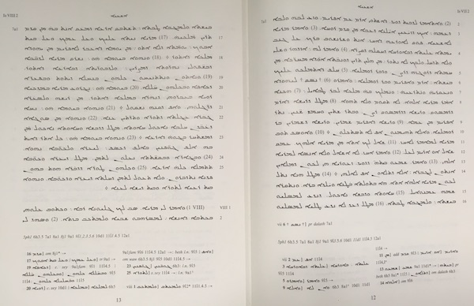

Peshitta
========

The Peshitta is the Syriac Old Testament.
See [Wikipedia](https://en.wikipedia.org/wiki/Peshitta).

This repo is a research environment for the study of the (Old Testament)
[Peshitta](https://en.wikipedia.org/wiki/Peshitta).

You can run your own programs off-line, and publish your work in online notebooks.
To that end, the plain text of the Peshitta has brought into
[Text-Fabric](https://dans-labs.github.io/text-fabric/Model/File-formats/)
format, which is a good starting point for textual data processing.

For **authors**, **provenance** and **license**: see [About](docs/about.md).

Software
========
The main processing tool is [Text-Fabric](docs/textfabric.md). It is instrumental to
turn the analysis of ancient data into computing narratives.

The ecosystem is Python and Jupyter notebooks.

Getting started
===============
Start with the
[tutorial](https://nbviewer.jupyter.org/github/annotation/tutorials/blob/master/peshitta/start.ipynb).

Status
======
This is **work in progress!**

**Currently, the headings turn up in the text itself. This will be remedied before the next major release.**

*   2018-10-16 Peshitta as a full-blown Text-Fabric [app](https://dans-labs.github.io/text-fabric/Api/Apps/).
    Archived at Zenodo.
